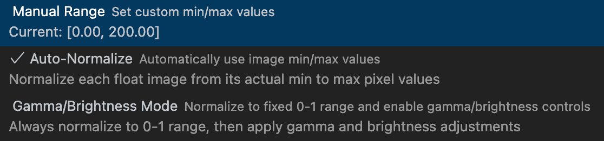

# Float and TIFF Visualizer for Visual Studio Code

A Image viewer for Visual Studio Code, for the formats tiff, exr, npy, png, jpg, ppm, pfm and pgm.
It visualizes 8 and 16 bit uint images and 16 and 32 bit float images. The visualization of all images can be normalized to a specified range.
Additionally it allows for brightness and gamma corrections and offers a color value picker.


## Features

- **Advanced TIFF Support**: Opens and displays complex TIFF files, including those with multiple channels and floating-point data types. Also supports compressed TIFF images using Deflate or LZW with predictors.
- **Additional files Support**: Support for exr, npy, png, jpg, ppm, pfm and pgm images with uint8/16 and float16/32 support for bw, rgb and rgba images.
- **Interactive Pixel Inspection**: Hover over any pixel to see its exact value in the status bar. For multi-channel images, all channel values are displayed.
- **Dynamic Normalization**: Interactively adjust the normalization range for floating-point images to reveal hidden details or choose automatic normalization.
- **Gamma and Brightness Correction**: Add or remove gamma correction for an image. To change brightness, the source gamma correction is removed, the brightness change (2\*\*Change) is multiplied in linear space onto the image, and the target gamma correction is applied.
- **Keep All Settings for Session**: A single VS Code Window keeps the settings applied on one image for all images.
- **Export as PNG**: Export the image, with the chosen image visualization as PNG for easy sharing.

Float Image Visualization Options:


## About

The extension is built on top of the built-in [VS Code Media Preview extension](https://github.com/microsoft/vscode/tree/main/extensions/media-preview). TIFF support uses the [geotiff library](https://github.com/geotiffjs/geotiff.js/). All coding was performed using Cursor and claude code.

## Known Issues and Missing Features

- Adding a Histogram
- Allow to rotate the image
- Allow going fast through all images
- Compare two images on top of each other to spot differences easily
- Issue with lzw from tifffile. lzw images from oiiotool work ...

## Feature Requests and Issues

If you have use cases that would be helpful for others or find problems, feel free to suggest them on the [GitHub repository](https://github.com/kleinicke/tiff-visualizer/issues). If you know how to fix bugs or how to implement certain features, feel free to contribute.

## Build notice

Instead of downloading from the Marketplace, you can also build from source by cloning the repo and building it by running:

```bash
git clone https://github.com/kleinicke/tiff-visualizer
cd tiff-visualizer
npm install
npm install -g vsce
vsce package
```

Then install the generated .vsix file via Extensions > Install from VSIX...
