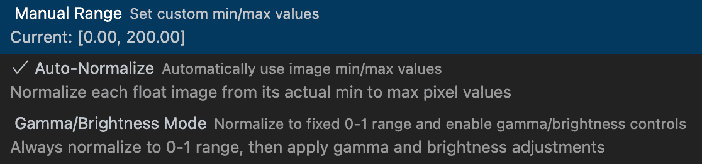

# Scientific Image Visualizer for Visual Studio Code

Rust-based image decoding and GPU accelerated rendering for high-bit-depth, floating-point, scientific, and standard image files inside Visual Studio Code.

Supports TIFF/OME-TIFF (including embedded multi-file filesets), EXR, NPY/NPZ, PNG, JPEG, WebP, AVIF, HDR, JXL, TGA, BMP, ICO, PPM, PFM, PBM, PGM, FITS, DICOM, classic NetCDF, Zeiss CZI, Nikon ND2 and Leica LIF.
Layered creative documents
are previewed from OpenRaster, Krita, Photoshop PSD/PSB, GIMP XCF, and Affinity Photo files.

The viewer supports 8-bit and 16-bit integer images as well as 16-bit and 32-bit floating-point images. You can inspect exact pixel values, normalize image data to custom ranges, adjust gamma and brightness, compare images, and export rendered or layered results. Decoding runs in Rust compiled to WebAssembly and compositing runs on the GPU, so large scientific images open and respond at native speed.

## Supported Sample Types

| Format                                       | uint8 |  uint16 | float16 | float32 | Notes                                                                                                                                                                                                                               |
| -------------------------------------------- | ----: | ------: | ------: | ------: | ----------------------------------------------------------------------------------------------------------------------------------------------------------------------------------------------------------------------------------- |
| TIFF / OME-TIFF                              |   Yes |     Yes |     Yes |     Yes | Rust/WASM decoding; multi-page and multi-file OME C/Z/T navigation                                                                                                                                                                  |
| EXR                                          |    No |      No |     Yes |     Yes | HDR floating-point format                                                                                                                                                                                                           |
| NPY / NPZ                                    |   Yes |     Yes |     Yes |     Yes | Also supports float64 and signed/unsigned integers up to 64 bit                                                                                                                                                                     |
| FITS / DICOM / NetCDF / CZI / ND2 / LIF      |   Yes |     Yes |      No |     Yes | Numeric HDUs, DICOM series/frames, classic NetCDF variables, MPAS meshes, and Zeiss/Nikon/Leica microscopy stacks                                                                                                                   |
| HDR                                          |    No |      No |      No |     Yes | Radiance RGBE, decoded to float32                                                                                                                                                                                                   |
| PFM                                          |    No |      No |      No |     Yes | Portable Float Map                                                                                                                                                                                                                  |
| PPM / PGM / PBM                              |   Yes |     Yes |      No |      No | PBM is 1-bit, shown as 8-bit                                                                                                                                                                                                        |
| PNG                                          |   Yes |     Yes |      No |      No | Palette PNGs become 8-bit RGBA                                                                                                                                                                                                      |
| JPEG / WebP / AVIF / BMP / ICO / TGA / JXL   |   Yes |      No |      No |      No | Decoded as 8-bit image data                                                                                                                                                                                                         |
| ORA / KRA / PSD / PSB / XCF / Affinity Photo |   Yes | PSD/PSB |      No | PSD/PSB | Saved/embedded previews; ORA, Krita paint layers, common XCF rasters, and PSD cached raster/group layers can also be composed; compatible PSD adjustments, Krita filter masks/layers, and XCF GIMP 3 layer effects are approximated |

Layered-document support reports approximated or unsupported operations instead of silently hiding them. Broader layer reconstruction and professional-tool compatibility are tracked in the [backlog](BACKLOG.md#5-layered-creative-document-formats-and-professional-layer-view).

NetCDF-4/HDF5, compressed CZI subblocks (JPEG, JPEG XR, Zstd), compressed ND2 frames and legacy (pre-2012) ND2 files are not yet supported. DICOM decodes native, JPEG Baseline and RLE Lossless pixel data; other transfer syntaxes are not yet supported.

Images above roughly 268 megapixels (for example 20480x20480) decode correctly and their pixel values, metadata and statistics remain fully available, but cannot be displayed: a browser canvas cannot exceed 2^28 pixels. Tiled rendering for images that large is planned.
Small synthetic files for manual checks live in `test-samples/scientific/`.
Extensionless DICOM studies can be opened with **Scientific Image Visualizer: Open Folder as DICOM Dataset**. The viewer scans technical headers, groups images by series, removes duplicate SOP instances, and orders slices spatially.

## Features

- **Fast and versatile TIFF Support**: TIFF decoding in [Rust](https://github.com/image-rs/image-tiff) compiled to WebAssembly. Opens high-bit-depth, floating-point, multi-channel, and compressed TIFF files, including the LZW, Deflate and Zstd GeoTIFFs that GDAL writes, tiled or stripped.
- **Scientific Image Inspection**: Inspect uint8, uint16, float16, and float32 image data in grayscale, RGB, and RGBA images.
- **Dataset Navigation**: Browse DICOM series/slices and multi-file OME C/Z/T planes as one logical dataset while the viewer switches physical files transparently.
- **Interactive Pixel Values**: Hover over any pixel to see its exact value in the status bar. For multi-channel images, all channel values are displayed.
- **Dynamic Normalization**: Adjust the visualization range interactively, use automatic min/max normalization, or view integer images as normalized float values.
- **Gamma and Brightness Correction**: Adjust source gamma, target gamma, and brightness while preserving linear-space behavior.
- **Histogram View**: Show a histogram overlay to inspect the current image distribution while tuning the visualization.
- **Automatic GPU Rendering**: Normal images, HDR/scientific images, and collections prefer WebGPU automatically, then fall back to WebGL2 and CPU rendering. Layers View retains its explicit backend diagnostics and controls.
- **Image Collections**: Group related images in one preview and quickly move between them without opening a tab for every file. Add individual images, folders, paths, or wildcard matches from the command palette and editor context menu.
  
- **Layers View**: Open one or more images in a dedicated Layers window for compositing and visual comparison. Imported layered documents retain collapsible nested groups, group visibility and Shift-solo controls, source-compatibility badges, inline renaming, editable/removable filters, persistent group expansion state, and keyboard undo/redo for layer/filter changes.
  Easily get the difference between two images or apply a mask onto one. This layer view allows dedicated compositions between multiple images. Basic compatibility with tools like photoshop.
- **NaN Color**: Choose how NaN values are displayed.
- **Session-Wide Settings**: A single VS Code window keeps visualization settings across opened images.
- **VS Code Native Controls**: Most options are available from the right-click menu inside the webview, command palette, or clickable status bar entries.
- **Metadata panel** shows file info, image statistics (min/max/mean/std) and Exif/GPS sub-IFD tags.
- **Multi-channel compositing**: Show several channels at once, each with its own tint, display range and opacity, added together the way emission combines at the detector — the "Composite" mode of Fiji or the "Display Adjustment" panel of Imaris. Channel names and colours come from OME metadata where the file provides them. Works both for interleaved multi-sample images and for OME-TIFF where each channel is a separate page. Solo, per-channel auto-range (percentile, so one hot pixel cannot flatten the signal), and an optional colormap per channel. This is arithmetic over scientific channels, deliberately separate from the Layers view's authoring blend modes.
- **Measurement and quantitative analysis**: Draw regions of interest and measure them — area, perimeter, mean/StdDev/min/max, integrated density, centroid, fitted ellipse, Feret diameters, circularity — in physical units, with the scale read automatically from OME-TIFF or TIFF resolution tags. Includes an intensity profile along a line, a magic wand that previews its selection on hover and picks its own tolerance, thresholding with a draggable histogram, eighteen global and local auto-threshold methods shown side by side that preview on hover, a stability curve that makes a robust threshold visible instead of guessed, and particle analysis with watershed splitting. The threshold is painted over the image — red for what it selected, green for what survives the filters — so a segmentation can be checked rather than assumed. Statistics always run on the raw sample values, never on the displayed image, and NaN/Infinity are excluded and reported rather than silently counted as zero. ROIs are stored as a readable JSON file next to the image so they diff in review; ImageJ `.roi` and `RoiSet.zip` are supported for exchange. Results export as long/tidy CSV with full provenance, as German-locale CSV, or as `.xlsx`, optionally with a pandas starter script.
- **Use anywhere** Use the same viewer outside VS Code on the static website:
  https://images.f-kleinicke.de

## How to Use

Open a supported image file in VS Code and choose **Scientific Image Visualizer** if VS Code asks which editor to use.

Use the status bar or right-click menu to change normalization, gamma, brightness, histogram visibility, mask filters, and export options.

For browsing a related set of files, use **Add Images to Collection** from the command palette or Explorer context menu. The collection overlay shows the current image and lets you navigate or remove entries.

Use **Open Layers View** from the command palette or status bar to create a new Layers window from the currently displayed image. When viewing a collection, choose whether to use only the current image or stack the complete collection. Add further images using the Layers panel's **+** button or **Add Image as Layer**.

Layers View and collections are intentionally exclusive. If a Layers window is active, **Add Images to Collection** explains that the image should be added as a layer instead. Pixel inspection reports the rendered composite there; switching between original and modified source values is intentionally unavailable. A visible histogram follows layer edits using a bounded sample of the rendered composite, while a hidden histogram adds no readback or scheduled work.

For a full-feature comparison, run **Select Image for Side-by-Side Compare**, open the other image, and run **Compare Side by Side with Selected**. This uses VS Code's native editor-group layout with a complete Scientific Image Visualizer on each side, including HDR/scientific decoding, acceleration, histogram, and pixel inspection. VS Code's built-in image diff remains available for browser-native formats, but its internal image renderer cannot be replaced by a custom TIFF/HDR renderer.

To measure something, open **Measure** from the right-click menu or press Ctrl/Cmd+Shift+M. Everything lives in that one panel; nothing about it is visible until you open it. Pick a tool, draw on the image, and the Results tab fills in — clicking a row highlights its ROI and vice versa.

Float Image Visualization Options:

## Multi-dimensional and multi-view images

- **OME-TIFF:** Navigate images/series, channels, Z slices, and timepoints from OME-XML. Multi-file datasets are presented as one logical image while C/Z/T changes transparently select the referenced TIFF and IFD. `BinaryOnly` members automatically follow metadata stored in a master OME-TIFF or companion `.ome`/`.ome.xml` file.
- **DICOM:** Use **Scientific Image Visualizer: Open Folder as DICOM Dataset**, select an acquisition series, and navigate its slices and available time, echo, and frame dimensions. Physical files remain grouped by DICOM identity instead of being mixed into a filename-sorted collection. Multi-frame objects, including JPEG Baseline objects, expose a Frame control.
- **Ordinary multi-page TIFF:** Navigate top-level pages even when no semantic dimension metadata is available.
- **CZI / ND2 / LIF:** Step through Z with the arrow keys and channels with `[` / `]`, or use one slider per axis; channel sliders show the dye name from the embedded metadata. Mosaic tiles are assembled into the full frame. ND2 exposes time and stage-position axes; LIF adds an `S` slider for choosing among the image series in the file.
- **NetCDF:** Select a numeric variable and move through its non-spatial dimensions. Regular X/Y arrays render as rasters; MPAS `nCells` fields render on their unstructured cell polygons in an equirectangular mesh view.

> **Medical-use notice:** DICOM support is provided for developer, research, and scientific visualization workflows. This extension is not a certified or cleared medical device and is not intended for diagnosis, treatment planning, clinical decision-making, or other clinical use. Do not rely on it as the sole means of viewing or interpreting medical images.

## Documentation

Full documentation ships with the extension: run **Scientific Image Visualizer: Show Documentation** from the Command Palette, or right-click inside an open image and choose **Show Documentation**. It opens in VS Code's markdown preview — no browser needed.

You can also read it on GitHub: [documentation index](https://github.com/kleinicke/tiff-visualizer/blob/main/docs/index.md) — [formats](https://github.com/kleinicke/tiff-visualizer/blob/main/docs/formats.md) · [viewing](https://github.com/kleinicke/tiff-visualizer/blob/main/docs/viewing.md) · [normalization & gamma](https://github.com/kleinicke/tiff-visualizer/blob/main/docs/rendering.md) · [measurement](https://github.com/kleinicke/tiff-visualizer/blob/main/docs/measure.md) · [layers](https://github.com/kleinicke/tiff-visualizer/blob/main/docs/layers.md) · [commands](https://github.com/kleinicke/tiff-visualizer/blob/main/docs/commands.md) · [troubleshooting](https://github.com/kleinicke/tiff-visualizer/blob/main/docs/troubleshooting.md)

## Companion website

A browser-based version is also available at [images.f-kleinicke.de](https://images.f-kleinicke.de/).

## Feature Requests and Issues

If you have use cases that would be helpful for others or find problems, feel free to suggest them on the [GitHub repository](https://github.com/kleinicke/tiff-visualizer/issues).
I'm open adding more file formats that can serve you.
