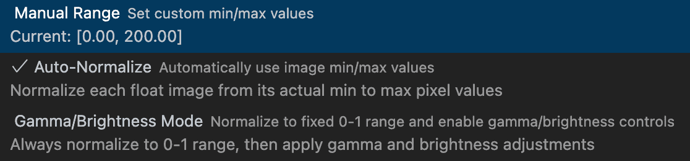

# Float and TIFF Visualizer for Visual Studio Code

An interactive image viewer supporting `tiff`, `exr`, `npy`, `png`, `jpg`, `ppm`, `pfm`, and `pgm` formats. Directly visualize and manipulate 8/16-bit uint and 16/32-bit float images in your editor.


## Feature Gallery

<table style="width:100%; text-align:center;">
    <tr>
        <td style="width:50%; vertical-align:top; border:0px; padding:10px;">
            <b>1. Pixel Inspection</b><br>
            <br>
            Examine exact values (per-channel) straight from the status bar.
        </td>
        <td style="width:50%; vertical-align:top; border:0px; padding:10px;">
            <b>2. Float Normalization</b><br>
            <br>
            Manually or automatically set bounds and apply linear gamma/brightness edits.
        </td>
    </tr>
    <tr>
        <td style="width:50%; vertical-align:top; border:0px; padding:10px;">
            <b>3. Image Overlays</b><br>
            <br>
            Blend, mask, and colormap multiple image layers on the fly.
        </td>
        <td style="width:50%; vertical-align:top; border:0px; padding:10px;">
            <b>4. PNG Export</b><br>
            <br>
            Persist settings across images and export your results entirely.
        </td>
    </tr>
</table>

## Detailed Features

- **Format Details**: Full support for uint8/16 and float16/32. Bw, rgb, and rgba channels.
- **Advanced TIFFs**: Includes Deflate or LZW with predictor support.
- **Persistent State**: Settings seamlessly carry over globally within a window.

**Float Image Options Panel:**


## Building From Source

```bash
git clone https://github.com/kleinicke/tiff-visualizer
cd tiff-visualizer
npm install && npm install -g vsce && vsce package
```
Then install the generated `.vsix` file via `Extensions > Install from VSIX...`

## About & Contributions
Created with Cursor and Claude. Extension wraps the internal [VS Code Media Preview](https://github.com/microsoft/vscode/tree/main/extensions/media-preview) and uses `geotiff.js`. Share feedback on [GitHub](https://github.com/kleinicke/tiff-visualizer/issues).
